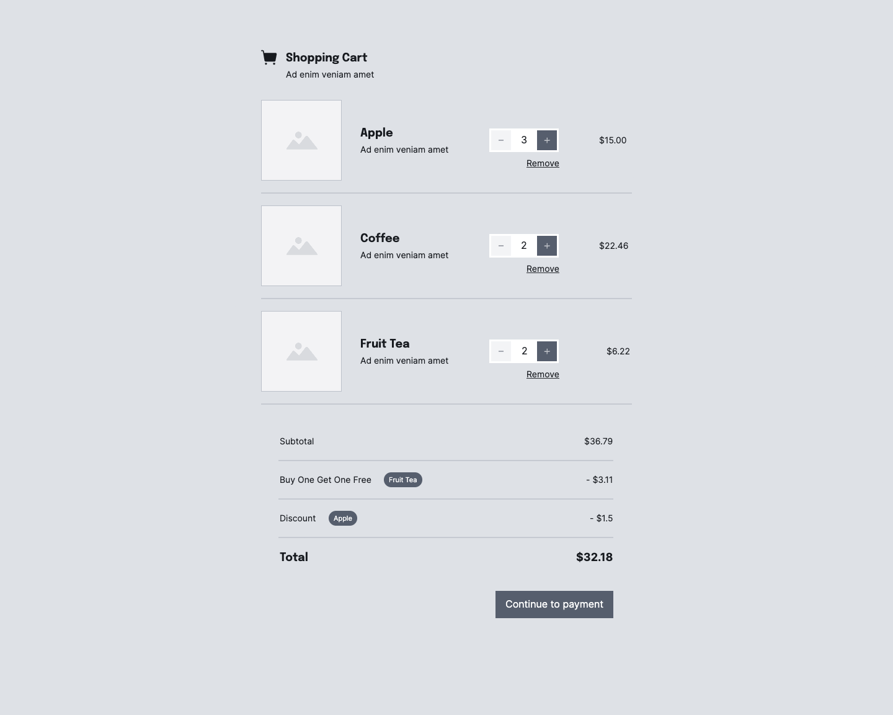

<h1 align="center"></h1>

# Welcome to TextMaster React Checkout exercise 👋

This is a simple coding exercise used by TextMaster for technical recruitment purposes. There are no limit of time to perform this task nor any particular restriction, however considering the rather simple nature of the test we will expect a reasonable delivery time.

## Getting Started 🎓

TextMaster's quest for global domination has prompted us to open a supermarket.
We sell only the three following products:

```
+--------------|--------------|---------+
| Product Code |     Name     |  Price  |
+--------------|--------------|---------+
|     FR1      |   Fruit tea  |  $3.11  |
|     AP1      |   Apple      |  $5.00  |
|     CF1      |   Coffee     | $11.23  |
+--------------|--------------|---------+
```

Our beloved CEO is a big fan of `buy-one-get-one-free` kind of offers and of
fruit tea. He wants us to add this rule to our checkout process.

On the other hand, our COO likes low prices and wants people buying apples to get
a price discount for bulk purchases. If you buy 3 or more apples, the price
should drop to `$4.50`.

Products can be scan in any order, and because the CEO and COO change
their minds often, we want to build a flexible system to handle our pricing
rules & discounts.

Since an image is worth a thousands words, here is a wireframe of what such a
checkout system could look like:

<p align="center">
  
  <em>A sample wireframe of what such checkout system could look like</em>
</p>

Your task is to build such system using the React framework. You are allowed to
use tools like TailwindCSS as well.

Clicking the product buttons adds items to the basket, the items in the basket are
listed and the total is updated.

You are free to design the system as you see fit, this image above is just an
example of what it could look like. Feel free to express your creativity!

The purpose of this test is to verify your abilities to code and see how you
architect an application and manage its state.

## Instructions

Please follow these instructions:

* Provide a readme to your solution on how to run it
* Provide your solution as a ZIP archive containing your code (without the `node_modules` directory)
* Do not fork this repository
* Do not share your solution publicly

Send your solution to `jobs+front-end@textmaster.com` with `tech-test+front@textmaster.com` in CC.
